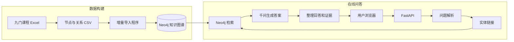

你的项目本质上是一个“知识图谱增强的大模型问答系统”，也可以叫 Graph-RAG 系统。

它不是重新训练千问，而是把 Neo4j 当成一份可靠的专业知识库：先让千问理解问题，再从知识图谱查证据，最后让千问结合证据组织答案。

## 一、系统整体结构



系统分为两部分：

- 离线部分：制作和导入知识图谱，不是每次提问都执行。
- 在线部分：用户每问一个问题，实时完成解析、查询和回答。

---

## 二、知识图谱是怎么建立的

### 1. 原始课程数据

你最初用 Excel 整理了九门计算机专业课程，包括课程、章节、主题、概念、性质、操作和应用等内容。

现在图谱中有：

- 9 门课程
- 2701 个节点
- 10630 条关系
- 158 条跨课程关系
- 18 种关系类型

节点中保存的主要信息有：

```text
node_id        唯一编号
name           知识点名称
alias          别名
entity_type    实体类型
course         所属课程
definition     定义
importance     重要程度
source         教材来源
book_page      教材页码
```

关系中保存：

```text
edge_id         关系编号
关系类型
reason          建立关系的原因
source          依据来源
confidence      置信度
evidence_text   证据说明
```

例如：

```text
数字电子技术
    ── PREREQUISITE_OF ──>
计算机组成原理
```

表示数字电子技术是计算机组成原理的前置课程。

### 2. 导入 Neo4j

Excel 数据经过整理后合并为：

- `nodes.csv`
- `relationships.csv`
- `cross_course_relationships.csv`

[import_incremental.py](C:/Users/30275/Desktop/大创/neo4j_import_files/import_incremental.py:1) 使用 `MERGE` 将数据写入 Neo4j：

- 节点不存在就创建；
- 节点存在就更新；
- 关系不存在就创建；
- 不会先删除整个数据库；
- 重复执行不会不断制造重复数据。

这部分属于知识图谱的“数据建设阶段”。

---

## 三、用户提出问题后发生了什么

以这个问题为例：

```text
学习计算机组成原理之前为什么要学数字电子技术？
```

### 第一步：网页提交问题

前端 JavaScript 将问题转换成 HTTP 请求：

```json
{
  "question": "学习计算机组成原理之前为什么要学数字电子技术？"
}
```

然后发送给：

```text
POST /api/ask
```

相关代码位于 [app.js](C:/Users/30275/Desktop/大创/kg_qa_system/static/app.js:369)。

网页不会直接连接千问或 Neo4j，所以 API Key 和数据库密码不会暴露给浏览器。

### 第二步：FastAPI 检查请求

[api.py](C:/Users/30275/Desktop/大创/kg_qa_system/api.py:370) 接收问题。

Pydantic 会检查：

- 是否提供了 `question`；
- 是否是字符串；
- 去掉首尾空格后是否为空；
- 是否超过500个字符。

不合法的请求返回 `422`，不会进入问答流程。

FastAPI 使用线程池调用现有同步问答函数，防止耗时的 Neo4j 或模型请求阻塞整个网站。

### 第三步：千问把自然语言转换为结构化结果

[question_parser.py](C:/Users/30275/Desktop/大创/kg_qa_system/question_parser.py:276) 负责理解问题，但它不回答问题。

大致得到：

```json
{
  "question_type": "relation_query",
  "anchor_entity": "计算机组成原理",
  "entities": ["计算机组成原理", "数字电子技术"],
  "relation_type": "PREREQUISITE_OF",
  "direction": "incoming",
  "complexity": "simple"
}
```

这里的 JSON 是程序与大模型之间的结构化通信格式。

关键设计是：千问不能创造任意关系。程序只允许使用图谱真实存在的18种关系。如果模型返回不存在的关系，白名单校验会拒绝它。

对于“先学什么”“包含什么”“有哪些操作”等非常明确的表达，程序还会优先使用关键词规则，降低模型误判概率。

### 第四步：实体链接

大模型识别出的“计算机组成原理”只是文字，程序还要找到 Neo4j 中具体对应的节点。

[entity_linker.py](C:/Users/30275/Desktop/大创/kg_qa_system/entity_linker.py:7) 会查询多个候选，然后按照下面的优先级排序：

1. 候选节点是否真的具有指定关系；
2. 名称匹配程度；
3. 节点重要性。

这样可以处理同名问题。例如“操作系统”既可能是一门课程，也可能是计算机组成原理中的一个概念。程序会结合当前查询关系选择更合适的节点，而不只是看名称。

如果两个候选仍然完全并列，程序会保留歧义，不随意认定其中一个。

### 第五步：查询 Neo4j

[neo4j_client.py](C:/Users/30275/Desktop/大创/kg_qa_system/neo4j_client.py:224) 提供两种核心查询。

明确关系查询：

```text
按实体 + 关系类型 + 方向查询
```

在这个例子中，核心实体是“计算机组成原理”，问题问它需要什么前置知识，因此查询指向它的关系：

```text
(数字电子技术)-[:PREREQUISITE_OF]->(计算机组成原理)
```

这就是 `incoming` 在程序内部的含义，但网页不会向用户展示这个内部字段。

开放式上下文查询：

```text
查询实体自身的定义和周围关系
```

当用户问“什么是流水线”“为什么要学习操作系统”等没有明确关系类型的问题时，系统会查询实体定义及周边最多若干条重要关系。

对于包含多个实体的问题，系统还会补充查询最多三个其他实体，避免检索数据过多导致 Token 成本上升。

### 第六步：千问根据证据生成答案

[answer_generator.py](C:/Users/30275/Desktop/大创/kg_qa_system/answer_generator.py:6) 将 Neo4j 结果压缩成大模型真正需要的证据，例如：

```text
核心实体：计算机组成原理
相关实体：数字电子技术
关系：PREREQUISITE_OF
原因：数字电路是运算器、控制器和存储器的硬件基础
来源：相关教材
置信度：0.94
```

然后把“用户问题 + 图谱证据”交给千问，要求它：

- 优先使用图谱证据；
- 不得与图谱冲突；
- 不得伪造来源；
- 图谱证据不足时可以用自身知识补充；
- 不显示内部 JSON、节点编号和查询方向；
- 使用适合学生理解的中文回答。

因此千问负责语言组织，Neo4j负责提供可靠依据。

---

## 四、为什么会有三种回答模式

系统根据是否检索到图谱证据，自动选择模式。

### 1. 知识图谱增强

```text
knowledge_graph
```

适用于查到了明确关系的问题，例如：

```text
学习操作系统之前应该学什么？
```

答案主要依据 Neo4j 中的关系记录。

### 2. 图谱与模型综合

```text
hybrid
```

适用于查到了实体及周边知识，但没有一条完全对应问题的明确关系。

例如：

```text
为什么要学习操作系统？
```

图谱提供操作系统的定义、课程内容和周边知识，千问再结合自身知识解释学习价值。

### 3. 大模型直接回答

```text
llm_only
```

如果图谱没有相关实体或证据，仍然让千问回答。

例如：

```text
Python列表和元组有什么区别？
```

这实现了你的核心需求：用户可以问任何问题，知识图谱负责增强回答，而不是限制回答范围。

---

## 五、模型是怎么选择的

[llm_client.py](C:/Users/30275/Desktop/大创/kg_qa_system/llm_client.py:20) 通过 OpenAI 兼容协议连接阿里云千问。

这里使用 `openai` Python 库不代表调用 OpenAI 模型。真正调用哪个平台由以下配置决定：

```text
base_url   阿里云兼容接口地址
api_key    阿里云 API Key
model      千问模型名称
```

每个问题通常会发生两次模型调用：

1. `qwen3.5-flash`：解析问题并返回 JSON。
2. 生成最终答案：
   - 普通问题使用 `qwen3.5-flash`；
   - 复杂问题使用 `qwen3.7-plus`，并开启有限思考。

这样既保留复杂问题的能力，也控制普通问题的费用。

---

## 六、FastAPI 后端负责什么

[api.py](C:/Users/30275/Desktop/大创/kg_qa_system/api.py:272) 是网站和问答核心之间的桥梁。

主要路由：

```text
GET  /             返回聊天网页
GET  /api/health   检查网站和Neo4j状态
POST /api/ask      提交问题
GET  /docs         FastAPI自动接口文档
```

`/api/health` 会实际连接 Neo4j：

- Neo4j正常：返回 `200 ok`；
- Neo4j未启动：返回 `503 degraded`；
- 即使显示 `degraded`，FastAPI网页服务本身仍可能正常运行。

`/api/ask` 返回：

```json
{
  "answer": "最终回答",
  "answer_mode": "knowledge_graph",
  "model": "qwen3.5-flash",
  "total_tokens": 959,
  "evidence": []
}
```

`build_evidence()` 会把内部图谱结果转换成用户可读证据：

- 关系英文名转换成中文；
- 最多返回8项；
- 清除空字段；
- 合并教材页码；
- 不返回节点编号、内部方向或 Cypher。

---

## 七、网页前端负责什么

前端由三个文件组成：

- [index.html](C:/Users/30275/Desktop/大创/kg_qa_system/static/index.html:1)：页面结构。
- [style.css](C:/Users/30275/Desktop/大创/kg_qa_system/static/style.css:1)：界面样式和手机适配。
- [app.js](C:/Users/30275/Desktop/大创/kg_qa_system/static/app.js:1)：聊天交互。

JavaScript负责：

- 读取输入问题；
- Enter发送、Shift+Enter换行；
- 调用 `/api/ask`；
- 显示“正在思考”；
- 显示回答模式、模型和 Token；
- 渲染标题、列表、加粗和代码块；
- 展开知识图谱依据；
- 检查 Neo4j 连接状态；
- 清空当前页面对话。

Markdown 没有直接使用不受控制的 `innerHTML`，而是通过 DOM 和 `textContent` 创建元素，从而降低模型输出恶意 HTML 的风险。

网页还设置了内容安全策略，限制脚本、网络连接和外部资源来源。

---

## 八、项目核心文件各自负责什么

| 文件 | 职责 |
|---|---|
| `llm_client.py` | 创建千问客户端、读取模型配置 |
| `question_parser.py` | 把自然语言问题转换成结构化 JSON |
| `entity_linker.py` | 把文字实体链接到 Neo4j 节点 |
| `neo4j_client.py` | 执行候选实体、关系和上下文查询 |
| `answer_generator.py` | 根据图谱证据生成最终答案 |
| `qa_system.py` | 串联完整问答流程 |
| `api.py` | 为网页提供 HTTP 接口 |
| `static/` | 网站聊天界面 |
| `.env` | 保存 API Key、Neo4j地址和密码 |
| `neo4j_import_files/` | 保存数据和增量导入程序 |

真正的核心入口是 [answer_question()](C:/Users/30275/Desktop/大创/kg_qa_system/qa_system.py:11)。命令行和网站最后都依赖这一套问答逻辑，因此不会形成两套互相矛盾的代码。

---

## 九、当前系统已经做好的安全措施

- API Key 和 Neo4j 密码只保存在后端 `.env`。
- `.env` 不发送给浏览器。
- 问题长度限制为500个字符。
- 模型生成的关系必须经过白名单校验。
- 不允许千问直接生成并执行任意 Cypher。
- 前端安全渲染模型回答。
- API 不返回堆栈和密码。
- 数据查询和证据数量有限制，控制费用。
- 测试使用模拟模型，不消耗千问额度。

目前37项自动测试主要检查程序行为和接口结构；你做的网页实测则验证了真实 Neo4j、千问和前后端链路。

---

## 十、当前版本的边界

现在是一个完整的本地 MVP，但还存在这些边界：

- 每个问题独立处理，没有多轮上下文记忆。
- 没有用户登录和聊天记录数据库。
- 没有正式的语义准确率评测集。
- 实体链接主要依赖名称、别名和关系上下文，没有向量检索。
- Neo4j完全关闭时，知识图谱问答接口可能返回暂不可用，而不是自动降级。
- 目前只能在你的电脑上运行，尚未部署到公网。
- 关系图可视化尚未加入，但不影响基本问答。

另外我在检查代码时发现一个很小的文字问题：[answer_generator.py](C:/Users/30275/Desktop/大创/kg_qa_system/answer_generator.py:82) 的提示词开头是：

```text
是一名专业、严谨且善于讲解的智能问答助手。
```

正常应为：

```text
你是一名专业、严谨且善于讲解的智能问答助手。
```

它通常不会导致程序报错，但建议后续补上“你”，让提示词表达完整。

一句话概括整个项目：

> 用千问理解用户问题，用 Neo4j 提供可靠的课程知识证据，再用千问把证据组织成自然答案，最后通过 FastAPI 和网页呈现给用户。